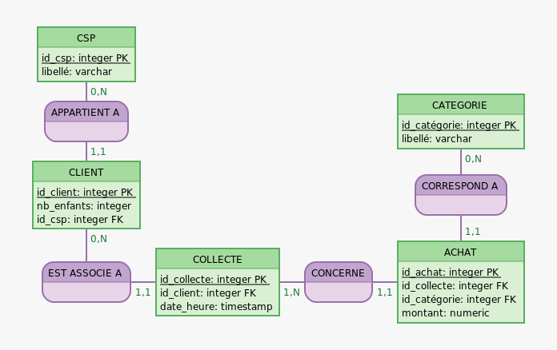

# Database Goldenline

## Description

Le back-end du projet Goldenline Marketing Dashboard se compose :
- D'une base de données PostreSQL
- De deux schémas : 'source' et 'marketing'

Le dossier `database` du projet contient les éléments permettant de créer et alimenter ces schémas.

## Schéma 'source'

DataPro n'ayant pas accès au logiciel de caisse de Goldenline, les données clientèle récupérées via les cartes de fidélité que les clients présentent à chaque passage en caisse, sont générées de manière aléatoire dans schéma 'source'.

## Schéma 'marketing'

Données récupérées du schéma 'source' avec anonynimisation des informations clients.

