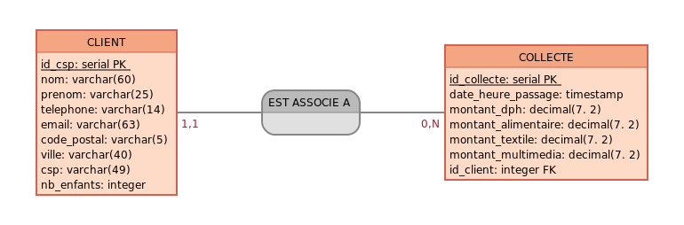

# Database Goldenline

## Description

Le back-end du projet Goldenline Marketing Dashboard se compose :
- D'une base de données PostreSQL
- De deux schémas : 'source' et 'marketing'

Le dossier `database` du projet contient les éléments permettant de créer et alimenter ces schémas.

## Glossaire

| Libellé | Description |
| --- | --- |
| **Client** | Un client est identifié par son nom, prénom, téléphone, email, code postal, ville, nombre d'enfants, catégorie socio-professionnelle. Est considérée comme client toute personne possédant une carte de fidélité Goldenline. Un client peut faire l'objet d'aucune collecte, s'il dispose d'une carte de fidélité sans avoir fait d'achat. |
| **Collecte** | Ensemble des éléments qui caractérisent un passage en caisse d'un client : identification du client, date et heure de passage, catégories des produits achetés, montant dépensé dans chaque catégorie. |
| **Categorie** | Liste des catégories de rayons chez Goldenline : DPH (Droguerie Parfumerie Hygiène), Alimentaire, Textile et Multimédia. |
| **Achat** | Un achat regroupe la catégorie et le montant dépensé dans cette catégorie lors d'un passage en caisse. Une collecte comprend au minimum 1 achat et 4 au plus. |
| **CSP** | Catégorie socio-professionnelle : - Agriculteurs exploitants (AE) - Artisants, commercants, chefs d'entreprise (ACCE) - Cadres et professions intellectuelles supérieures (CPIS) - Professions intermédiaires (PI) - Employés (E) - Retraités (R) - Sans activité professionnelle |
| **Dépense** | Somme des montants dépensés par le ou les clients. |
| **Panier moyen** | Mesure permettant d'évaluer la valeur totale des produits achetés par un client lors d'une seule transaction. Panier moyen = $\frac{\sum_{ }\text{Montants des dépenses}}{\text{Nombre de transactions}}$ Exemple : Panier moyen Textile janvier 2023 = $\frac{\text{Montant total des ventes de la catégorie Textile en janvier 2023}}{\text{Nombre d'achats de janvier 2023 dans la catégorie Textile}}$ |

## Objectif

Forunir les données nécessaires pour générer les graphiques du site web Goldenline Marketing Dashboard :

- Dépenses :
  - par période (jour, mois, trimestre, année)
  - par catégorie (DPH, Alimentaire, Textile, Multimédia)
  - par catégorie socio-professionnelle
  - par nombre d'enfants des clients (0, 1, 2, 3, 4 et plus)
- Panier moyen :
  - par période (jour, mois, trimestre, année)
  - par catégorie (DPH, Alimentaire, Textile, Multimédia)
  - par catégorie socio-professionnelle
  - par nombre d'enfants des clients (0, 1, 2, 3, 4 et plus)

Les principes du RGPD et les recommandations de la CNIL devront être respectés :
- Protection des données personnelles : anonymisation des données clients
- Obligation de limiter la quantités de données dès la conception : seules les données strictement nécessaires seront stockées

## Fonctionnement

## Schéma 'source'

DataPro n'ayant pas accès au logiciel de caisse de Goldenline, les données clientèle récupérées via les cartes de fidélité que les clients présentent à chaque passage en caisse, sont générées de manière aléatoire dans le schéma 'source'.

## Schéma 'marketing'

Afin de répondre aux besoins de d'analyse et de visualisation, les données pertinentes du schéma 'source' sont transférées dans le schéma 'marketing'.
Ce transfert s'accompagne de l'anonynimisation des informations clients.

