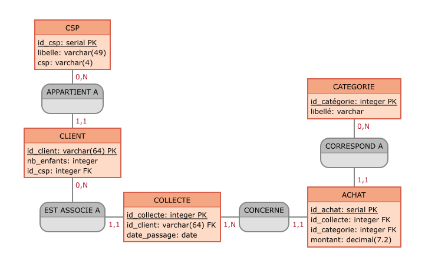

# Database Goldenline

## Description

Le back-end du projet Goldenline Marketing Dashboard se compose :
- D'une base de données PostreSQL
- De deux schémas : 'source' et 'marketing'

Le dossier `database` du projet contient les éléments permettant de créer et alimenter ces schémas.

## Glossaire

| Libellé | Description |
| --- | --- |
| **Client** | Un client est identifié par son nom, prénom, téléphone, email, code postal, ville, nombre d'enfants, catégorie socio-professionnelle. Est considérée comme client toute personne possédant une carte de fidélité Goldenline. Un client peut faire l'objet d'aucune collecte, s'il dispose d'une carte de fidélité sans avoir fait d'achat. |
| **Collecte** | Ensemble des éléments qui caractérisent un passage en caisse d'un client : identification du client, date et heure de passage, catégories des produits achetés, montant dépensé dans chaque catégorie. |
| **Categorie** | Liste des catégories de rayons chez Goldenline : DPH (Droguerie Parfumerie Hygiène), Alimentaire, Textile et Multimédia. |
| **Achat** | Un achat regroupe la catégorie et le montant dépensé dans cette catégorie lors d'un passage en caisse. Une collecte comprend au minimum 1 achat et 4 au plus. |
| **CSP** | Catégorie socio-professionnelle : - Agriculteurs exploitants (AE) - Artisants, commercants, chefs d'entreprise (ACCE) - Cadres et professions intellectuelles supérieures (CPIS) - Professions intermédiaires (PI) - Employés (E) - Retraités (R) - Sans activité professionnelle |  

## Schéma 'source'

DataPro n'ayant pas accès au logiciel de caisse de Goldenline, les données clientèle récupérées via les cartes de fidélité que les clients présentent à chaque passage en caisse, sont générées de manière aléatoire dans le schéma 'source'.

## Schéma 'marketing'

Données récupérées du schéma 'source' avec anonynimisation des informations clients.

